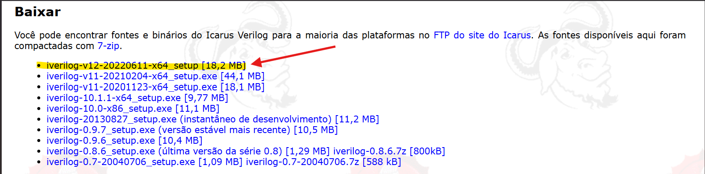
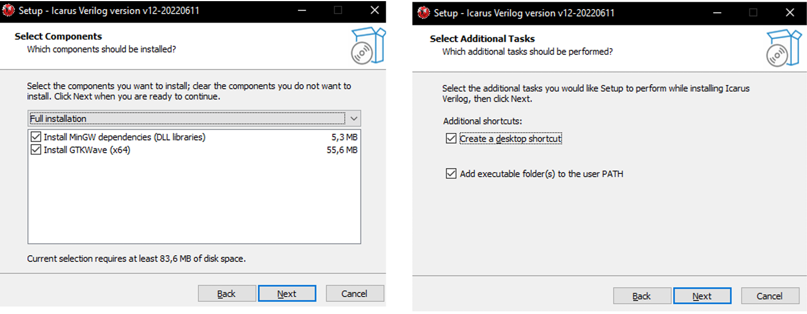
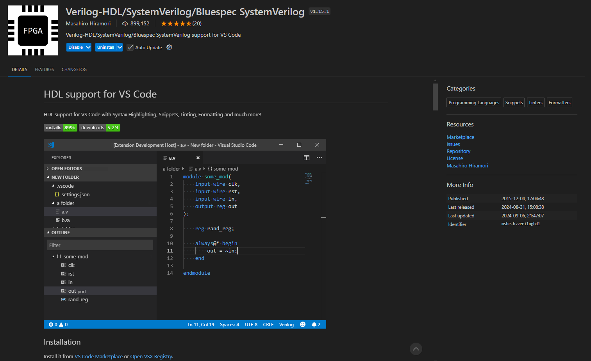
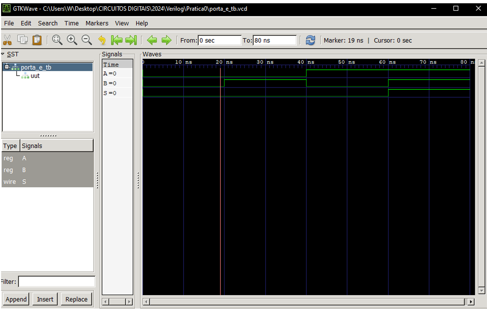

# Sobre
Este repositório é dedicado ao componente Circuitos Digitais do curso de Bacharel em Ciência da Computação, professor responsável pelo componente: Walter Oliveira.

 

# Conteúdo
Neste repositório você encontrará todo o conteúdo apresentado em todo o semestre letivo do componente, você vai encontrar nesse repositório:

* Atividades práticas;
* Material sobre o componente;
* Pesquisa Curricularizada de Graduação.

 

# Pré-requisitos 
Você vai precisar dessas ferramentas instaladas, para desenvolver, rodar e testar os circuitos:
* Sistema Operacional Windows
* Visual Studio Code;
* Icarus Verilog;
* GTKWave.

 

# Instrução de instalação das ferramentas
Essa instrução de instalação é dedicada apenas para o sistema operacional Windows, porém o Icarus Verilog está disponível também para Linux. Caso deseje instalar o Icarus para Linux, esse link https://github.com/steveicarus/iverilog terá toda a informação necessária.

### Instalação do Icarus e GTKWave
Primeiramente, vamos instalar o Icarus, compilador de Verilog gratuito. Para isso, procure Icarus Verilog no Google ou acesse https://bleyer.org/icarus

Baixe e execute o instalador. Nas opções de instalação, selecione Full Instalation e adicione o executável no PATH

 

### Extensão do Verilog no VS Code
Recomendo instalar a extensão "Verilog-HDL/SystemVerilog/Bluespec SystemVerilog" no VS Code para uma melhor experiência com os codigos em Verilog.

Com o VS Code aberto, vá em extensões, ou digite CTRL + SHIFT + X para abrir extensões. Procure por Verilog e instale a extensão "Verilog-HDL/SystemVerilog/Bluespec SystemVerilog".

 

# Como rodar
Para rodar um circuito em Verilog, precisamos rodar ele por linha de comando (terminal), porém para não ter problemas, verifique sempre se você está no mesmo diretório do circuito em que deseja rodar e testar.
Estando no mesmo diretório, digite no prompt:
### iverilog -o <exemplo.vvp> <testebench.v>

Este comando iverilog-o <exemplo.vvp> <testebench.v> gera um arquivo .vvp. Se o comando foi executado sem erros, na mesma pasta irá aparecer o arquivo resultado.vvp. Agora, iremos gerar o arquivo .vcd para ser aberto no GTKwave. Para isso, rode o seguinte comando:

### vvp exemplo.vvp

 Este comando realiza a simulação do testbench e criar um arquivo com a extensão exemplo.vcd, por fim vamos abrir o GTKWave digitando:

### gtkwave exemplo.vcd

 Com o GTKWave aberto, clique no testebench.v e selecione em baixo os sinais do testbench, e clique em Append.
 